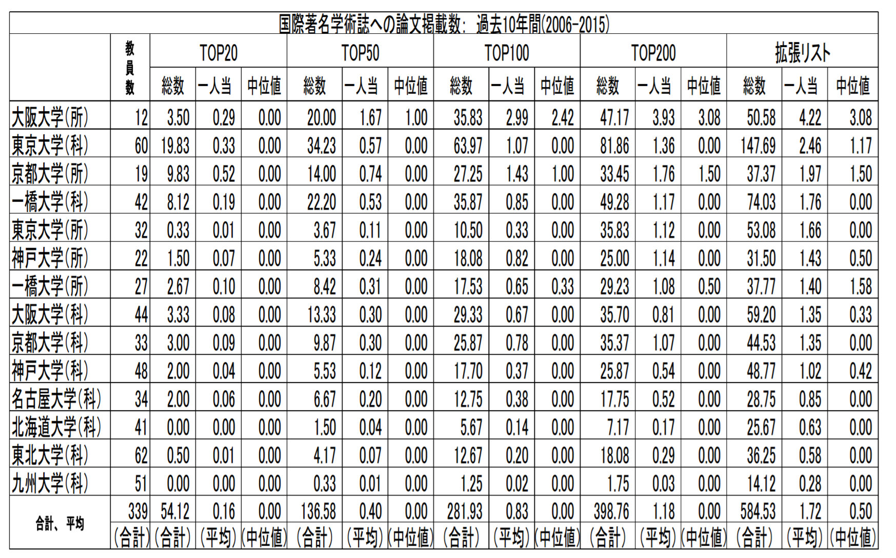

```{r setup, include=FALSE}
library(magrittr)
library(htmlTable)
knitr::opts_chunk$set(echo = FALSE, warning = FALSE, message = FALSE)
Sys.setlocale(category = 'LC_ALL','Japanese_Japan.932')
```


国際的に認められた査読誌に論文を掲載することは経済学者にとってもっとも重要な仕事の一つです。社会科学の役割はいま・ここにある一個の社会を超えた社会一般にとって意義のある普遍的な洞察を導出することにあり、国際的に認められた査読誌の編集者と査読者に対して自身の研究の意義を説得することはそのための第一歩だと位置づけられるからです。

この観点からみて懸念すべき論点が河野太郎衆議院議員から<a href="https://twitter.com/konotarogomame/status/820276016765509633" target="_blank">最近提起されました</a>。**日本の主要な国立大学に所属する経済学者の過半数は過去10年間査読論文を全く書いてこなかったのではないか？**というのです。

河野氏が依拠してるのは、二神孝一、神谷和也、芹澤成弘、柴田章久の四名によって書かれ、大阪大学社会科学研究所のディスカッション・ペーパーとして刊行された「[９大学経済学研究科及び附置研究所の研究業績比較調査（2015年)](http://www.iser.osaka-u.ac.jp/library/dp/2016/DP0974.pdf)」という論文です。この論文(以下**阪大論文**)は、大阪大学、東京大学、京都大学、一橋大学、神戸大学、名古屋大学、東北大学、北海道大学、九州大学の経済学研究科および附置研究所の教員の業績リストを独自の方法で評価・比較した論文です。

具体的には、Web of ScienceのArticle Influence Scoreに基づいて経済学の査読誌をTop20、Top50、Top100、Top200に分類した上で、各教員の各ランクの査読誌への論文の掲載数を計算、これを部局ごとに平均や中央値で評価しています。ここでは「掲載数」は著者数で割った値として定義されていることに注意してください。例えば、ある教員がTop20のジャーナルに論文を掲載して、その著者数が2だった場合は、0.5とカウントされます。Top20のスコアが1.5だった場合、2006-2015年のあいだにTop 20のジャーナルに掲載した論文の1/著者数の和が1.5になっている、ということになります。その結果が以下の表です。：

<center>

</center>

なんとTop 200の査読誌に至ってもなお対象となった14部局のうち11の部局において、論文掲載数の中央値が0になっています。この結果を受けて河野氏は次のように書いています：

> 大半の大学が、論文掲載数の中位値が０、つまり「その部局の過半数の研究者が、当該期間に当該リストの学術誌へ掲載した論文数がゼロである」ということに驚きました。これはどう解釈したらよいのでしょうか。これは経済学部独特の結果なのでしょうか。

さて、この結果をどう解釈すればよいのでしょうか？

阪大論文は議論の出発点として意義のあるものです。しかし、その手法には不適切な点と不十分な点があります。不適切な点は各部局において比較対象となる教員の選定基準です。不十分な点は比較のスコープの取り方です。 以下順にみていきましょう。

 
# 対象となる教員の選定基準の問題 
### 阪大論文の問題点
阪大論文では各部局の常勤教員を対象として各部局の掲載数、一人当たり掲載数、個人掲載数の中央値を計算しています。しかし、常勤教員のなかには「経済学の国際的査読誌への掲載数」によって業績を評価することが適切ではない教員が多数含まれています。 

まず、多くの大学の研究科は教養科目を教えるために語学や数学の教員をかかえています。留学生のメンター的な役割を担う教員が含まれている場合もあります。大学付属の研究所にはこのような教員は配置されません。これらの教員を「経済学」の査読誌への掲載をもって評価するのは明らかに不適切です。   

次に、大学によっては、経済史などの歴史学系教員、公共政策などの実務家教育教員など、「国際的」査読誌で業績を評価することが必ずしも適切ではない教員が含まれています。 

こうした教員も含めて「国際的」査読誌で評価**すべき**であるという意見はありえます。また、どのような教員を一つの部局に配置するかという人事戦略も含めて部局間のパフォーマンスを比較したいというのであればこうした教員を対象範囲に含めることも正当化されるかもしれません。 

しかし、比較分析の基本は属性をそろえることです。まずは、それぞれの部局において「国際的査読誌への掲載数によって業績を評価すべきだというコンセンサスが取れているタイプ」の教員(以下**近経教員**と呼ぶ)に絞って、統制のとれた比較を行うべきです。 


各大学のどの教員が「近経教員」にあたるのか外部からは定かではないという分析上の難しさはあります。それでも、各大学の教員二、三人に独立に裏取りをすれば十分対応できる話です。阪大論文では教員リストをつくる段階で各大学の教員に直接コンタクトをとって確認をしているようですが、その際にあわせて「近経教員」のリストをつくることは可能であったし、そうするべきだったと思います。 

### 一橋大学経済学研究科における「近経教員」の業績評価 
ここでは私が所属する一橋大学大学院経済学研究科を例にとって比較対象とする教員の選定基準がいかに結果に影響を与えるのかを明らかにします。 

阪大論文では2015年4月1付けの各大学各部局のホームページの教員紹介ページを元に常勤教員リストを作成しています。あいにく現時点(2017年2月)時点では当時のホームページは確認できません。ただ、一橋の場合は2015年3月時点の教員リストが[ウェブ上で確認できる](http://www.econ.hit-u.ac.jp/~koho/jpn/introduce/kokai/hokoku/hokoku2015/second/index.html)ので、こちらを元にリストを作成します。 

ここには48名の教員が掲載されています。阪大論文では一橋大学経済学研究科の対象教員は42名となっています。この48名の教員の中には語学・数学系教員、公共政策に関する実務的な教育のための教員、伝統的な歴史研究に従事する教員、マルクス経済学を研究する教員、留学生のメンターなど、「近経教員」と同じ業績基準で評価するのが適切ではない教員が多数含まれています。

**そうした「非近経教員」をのぞいてみたところ対象教員数は28名となりました。阪大論文の42名はずいぶんと多様な教員を含んだ数字だったようです。**これでもまだ「近経教員」をかなり広く取っています。東京大学の経済学研究科についても同じような計算を<a href="http://unrepresentativeagent.blogspot.jp/2017/01/why-median-person-at-tokyo-university.html" target="_blank">Unrepresentative Agentさんがブログで試みています</a>が、ここでもHPに記載されている64名の教員中「近経教員」と呼べるのは38名程度ではないかと結論づけています。

```{r}
# import journal rank data
journal_ranks <- readr::read_csv("../knitr_files/blog_post_20170220_files/journal_ranks.csv")
# import Hitotsubashi faculty data
data <- readr::read_csv("../knitr_files/blog_post_20170220_files/hitotubashi_contributions.csv",
                        locale = readr::locale(encoding = "cp932"))
# filter mainstream faculty
data <- dplyr::group_by(data, name) %>%
  dplyr::mutate(major = max(major, na.rm = TRUE)) %>%
  dplyr::filter(major == 1) %>%
  dplyr::group_by()
data <- dplyr::mutate(data, journal = ifelse(is.na(journal), "none", journal))
data <- fuzzyjoin::stringdist_left_join(data, journal_ranks, by = "journal", distance_col = "distance")
data <- dplyr::mutate(data, rank = ifelse(is.na(rank), "none", rank))
# count the number of mainstream faculty
num.faculty <- length(unique(data$name))
# compute the effective number of authors
data <- dplyr::mutate(data, effective_num = 1/authors,
                      effective_num = ifelse(journal.x == "none", 0, effective_num))
# average number of authors
average_authors <- dplyr::summarise(data, mean(authors, na.rm = TRUE)) %>%
  as.numeric()
average_authors <- round(average_authors, 2)
# summarise data
data.summary <- dplyr::group_by(data, name, rank) %>%
  dplyr::summarise(effective_num = sum(effective_num)) %>%
  dplyr::ungroup()
header <- expand.grid(unique(data$name), unique(data$rank))
colnames(header) <- c("name", "rank")
header <- dplyr::mutate_all(header, dplyr::funs(as.character))
data.summary <- dplyr::left_join(header, data.summary, by = c("name", "rank")) %>%
  dplyr::tbl_df()
data.summary <- dplyr::mutate(data.summary, effective_num = ifelse(is.na(effective_num), 0, effective_num))
# compute top 20 score
summary.top20 <- dplyr::filter(data.summary, rank == "top20") %>%
  dplyr::summarise(total = sum(effective_num),
                mean = sum(effective_num)/num.faculty,
                median = quantile(effective_num, 0.5)) %>%
  dplyr::ungroup()
# compute top 50 score
summary.top50 <- dplyr::filter(data.summary, (rank == "top20" | rank == "top50")) %>%
  dplyr::group_by(name) %>%
  dplyr::summarise(effective_num = sum(effective_num)) %>%
  dplyr::ungroup() %>%
  dplyr::summarise(total = sum(effective_num),
                mean = sum(effective_num)/num.faculty,
                median = quantile(effective_num, 0.5)) %>%
  dplyr::ungroup()
# compute top 100 score
summary.top100 <- dplyr::filter(data.summary, (rank == "top20" | rank == "top50" | rank == "top100")) %>%
  dplyr::group_by(name) %>%
  dplyr::summarise(effective_num = sum(effective_num)) %>%
  dplyr::ungroup() %>%
  dplyr::summarise(total = sum(effective_num),
                mean = sum(effective_num)/num.faculty,
                median = quantile(effective_num, 0.5)) %>%
  dplyr::ungroup()
# compute top 200 score
summary.top200 <- dplyr::filter(data.summary, (rank == "top20" | rank == "top50" | rank == "top100" | rank == "top200")) %>%
  dplyr::group_by(name) %>%
  dplyr::summarise(effective_num = sum(effective_num)) %>%
  dplyr::ungroup() %>%
  dplyr::summarise(total = sum(effective_num),
                mean = sum(effective_num)/num.faculty,
                median = quantile(effective_num, 0.5)) %>%
  dplyr::ungroup()
# compute the total score
summary.all <- data.summary %>%
  dplyr::group_by(name) %>%
  dplyr::summarise(effective_num = sum(effective_num)) %>%
  dplyr::ungroup() %>%
  dplyr::summarise(total = sum(effective_num),
                mean = sum(effective_num)/num.faculty,
                median = quantile(effective_num, 0.5)) %>%
  dplyr::ungroup()
table <- cbind(summary.top20, summary.top50, summary.top100, summary.top200, summary.all)
table <- as.numeric(table)
table <- format(round(table, 2), 2)
table <- t(as.matrix(table))
table <- cbind(num.faculty, table)

table.handai <- c("42",
                  "8.12", "0.19", "0.00",
                  "22.20", "0.53", "0.00",
                  "35.87", "0.85", "0.00",
                  "49.28", "1.17", "0.00",
                  "n.a.", "n.a.", "n.a.")
table <- rbind(table, table.handai)
```


この28名の「近経教員」を対象に論文掲載数を調べ、阪大論文と同じ方法で一人当たりの掲載数と各教員の掲載数の部局内中央値を再計算したのが次の表です。ここで「All」と書かれた欄で対象としているのは英語論文のみだという点にもご注意ください。実際にはここで対象とした英語論文と同じぐらいの数の日本語論文を各教員は書いています。

<center>
```{r, results = "asis"}
header <- c("近経", "阪大論文")
rnames <- c("教員数",
                     "総数", "一人当たり", "中央値",
                     "総数", "一人当たり", "中央値",
                     "総数", "一人当たり", "中央値",
                     "総数", "一人当たり", "中央値",
                     "総数", "一人当たり", "中央値")
table <- t(table)
htmlTable(
  x = table,
  header = header,
  rnames = rnames,
  caption = "国際著名学術誌への論文掲載数： (2006-2015)",
  n.rgroup = c(1, 3, 3, 3, 3),
  rgroup = c("",
             "Top 20",
             "Top 50",
             "Top 100",
             "Top 200",
             "All")
)
```
</center>

見ての通り、Top20の掲載数の総数は近経教員に限定しても減少していません。Top20の査読誌に載せているのは近経教員だけだということです。その結果として一人当たりの掲載数は0.19から0.29に上昇しています。Top 50、Top100、Top 200の一人あたりの掲載数はそれぞれ0.53から0.79、0.85から1.20、1.17から1.58へと上昇しています。

阪大論文では多くの部局で掲載数の中央値が0になることが問題視されていましたが、一橋大学経済学研究科の場合、近経教員に限定すると、少なくともTop100論文では掲載数が0.38と正の値になっています。語学系、数学系教員などを多数含むリストを使えば中央値はほぼ自動的に0になります。阪大論文の教員選定基準にもとづいて中央値を計算しその結果に着目して日本の主要大学における経済学者の業績に関する含意をみちびくことは間違いだといってよいでしょう。


参考までに書いておくと阪大論文における阪大社会科学研究所の一人あたりの数値はTop20で0.29、Top50で1.67、Top100で2.99、Top200で3.93となっています。いずれにせよ大阪大学社会科学研究所が過去十年間において比較的優れた業績を上げているとは言えそうです。


# 比較のスコープの取り方の問題 
 
このように対象教員をどう取るかによって論文掲載数も大学間の順位も微妙に変化しますが、**阪大論文の対象となっている国立大学の経済学研究科の業績なんて正直言って五十歩百歩です。**国内の大学の業績を比較したところで大した政策的含意は出てきません。経済学はきわめてグローバル化された学問分野です。業績でも、採用市場でも、競合しているのは海外の大学です。政策的にも経営戦略的にも国内の大学との比較よりも海外との大学の比較のほうがよっぽど重要です。

では海外の、とくに、経済学の本場である米国でのスコアはどのようなものになっているのでしょうか？ここで<a href="https://twitter.com/inoakio/status/824851699042918401" target="_blank">米国経済学PhD在学中の@inoakioさんが計算してくれた米国州立大学の同様の指標</a>をみてみましょう。順にUniversity of Wisconsin-Madison, Ohaio State University, University of Minnesota, University of California, Berkeleyです。<a herf="https://www.topuniversities.com/university-rankings/university-subject-rankings/2016/economics-econometrics" target="_blank">2016年のQSランキングのEconomics & Econometrics部門</a>ではそれぞれ48位、51-100位、42位、4位となっていますが、どこも経済学者の間では名門として有名な大学です。

<center>
```{r, results = "asis"}
table_stateuniversities <- readr::read_csv("../knitr_files/blog_post_20170220_files/stateuniversities_contributions.csv",
                                           col_names = FALSE)
table_stateuniversities <- t(table_stateuniversities)
table_stateuniversities[2:13, ] <- format(table_stateuniversities[2:13, ], 2)
table_stateuniversities <- cbind(table[1:13, 1], table_stateuniversities)
colnames(table_stateuniversities) <- c("一橋近経", "UW-Madison", "OSU", "UMN", "UC Berkley")
rownames(table_stateuniversities) <- c("教員数",
                     "総数", "一人当たり", "中央値",
                     "総数", "一人当たり", "中央値",
                     "総数", "一人当たり", "中央値",
                     "総数", "一人当たり", "中央値")
htmlTable(
  x = table_stateuniversities,
  caption = "国際著名学術誌への論文掲載数： (2006-2015)",
  n.rgroup = c(1, 3, 3, 3, 3),
  rgroup = c("",
             "Top 20",
             "Top 50",
             "Top 100",
             "Top 200")
)
```
</center>

**見ての通りTop 20の一人あたり掲載数で阪大論文中の日本の国立大学の数値と5-10倍近い差があります。**国内の大学でTop 200の値が0.1大きいとか議論している場合ではないのです。しかもこれはあくまで州立大学の値です。ハーバード、MIT、シカゴ、スタンフォード、プリンストンといったいわゆるTop 5スクールに至っては一体どのような値がはじき出されるのでしょうか？ さらにいうと、これらの大学ではTop 20以外のジャーナルはそもそも業績とはカウントされず、Top 20の中でもEconometrica, American Economic Review, Quarterly Journal of Economics, Journal of Political Economy, Review of Economic StudiesといったTop 5ジャーナルでなければ大して評価もされなかったりするわけです。

政策的にであれ経営戦略的にであれ、ベンチマーキングはまずこの彼我の圧倒的な戦力の差を認識することから始めるべきだと思います。その上で、日本の国立大学の経済学部がこの差をどう埋めていくのか、そもそも諦めるのか、諦めるならどのレベルを目指していくのか、といった方策を考えていく必要があります。この観点から言えば、次に必要な比較は、日本の国立大学が直接業績・採用において競合している大学、すなわち、シンガポール・香港・オーストラリアなどの主要大学との比較だと思います。


# 「日本人研究者」の業績 > 「日本の大学」の業績

ここまで「日本の(国立)大学」の経済学部の業績を中心に分析してきました。しかし、これでは「日本人研究者」の業績を評価としては不十分です。なぜなら、経済学部は毎年10人以上の海外のトップPhDプログラムに留学生として送り出しており、
海外で初職を得てそのまま海外に残る人も少なくないからです。<a href="https://sites.google.com/site/economistsjapan/list" target="_blank">大阪大学の安田准教授の調べによれば</a>、現在128名の日本人が海外の研究機関で常勤の職についているようです(ただし、この中には何人かすでに国内の研究機関に移籍している者や日系米国人など日本国籍を所有していない者が含まれています)。次回はこの「海外在住日本人経済学者」たちの業績をみていきます。

## 注釈

この記事を書くために用いたデータとRmdファイルは<a href="https://github.com/kohei-kawaguchi/blog-files" target="_blank">GitHub上で公開</a>しています。結果の複製・拡張などにご自由にご利用ください。分析の誤りなどを発見した場合は著者までご連絡ください。


 
 